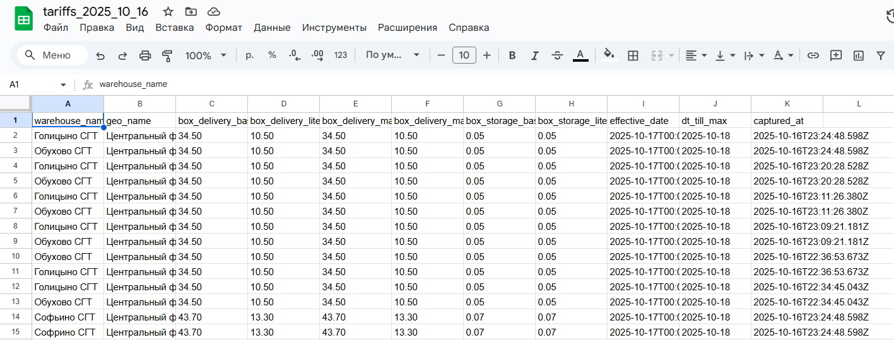

Тарифы Wildberries - Система мониторинга

Система для автоматического сбора данных о тарифах Wildberries, хранения в PostgreSQL и экспорта в Google Таблицы.

Оглавление

    1. Функциональность

    2. Архитектура

    3. Требования

    4. Установка и настройка

1. Функциональность

Автоматический сбор данных: ежечасный сбор тарифов с WB API

Хранение в PostgreSQL: структурированное хранение с ежедневными таблицами

Экспорт в Google Таблицы: автоматическое обновление Google Sheets. Так как я не смогла настроить права в console.cloud.google.com, так как нужна привязка счёта даже для пробного периода, чтобы таблица создавалась автоматически и парсила данные из БД, пришлось вручную создавать таблицы и обращаться к ним по айдишнику. 

REST API: управление системой через HTTP endpoints

Автообновление: фоновая синхронизация данных

Миграции находятся в папке migrations/ и выполняются автоматически при запуске приложения.

Пример данных в Google-таблице:

2. Архитектура

app.ts (Express Server)

├── scheduler-service.ts (Планировщик задач)

├── wb-api-service.ts (WB API клиент)

├── database-manager.ts (Управление БД)

├── spreadsheet-manager.ts (Управление Google Sheets)

└── google-sheets-service.ts (Google API клиент)

3. Требования

Системные требования

Node.js 18+

PostgreSQL 12+

npm

API Ключи

WB API Key: ключ от Wildberries API

Google Service Account: аккаунт для работы с Google Sheets API

4. Установка и настройка

docker-compose up

Далее можно открыть в Докере терминал и
    - ввести docker exec -it postgres psql -U postgres -c "какой-то sql код"
    - ввести любую команду
